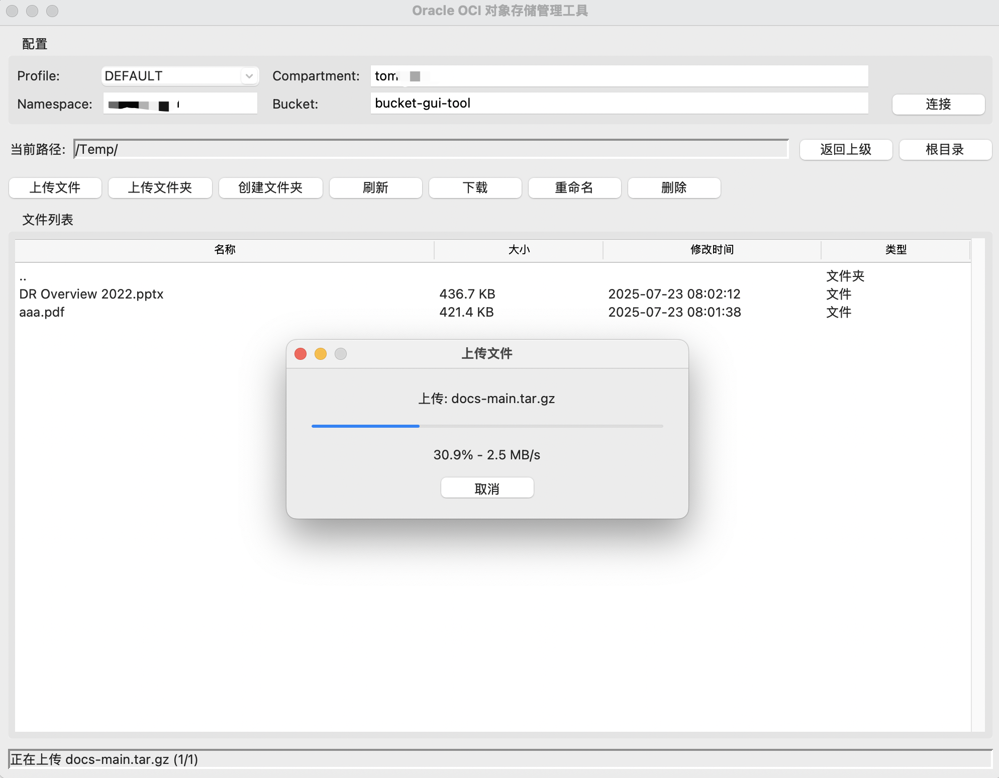

### GUI Desktop Application for OCI Object Storage
#### About
It's a quick python app for those people want a desktop gui to connect OCI OSS.
- 1.First is to install oci cli tool on your host.
- 2.Second is to setup your ~/.oci/config profile with OCI IAM.
- 3.Run this python app.

#### How to run this app?
```commandline
# 1.install uv tool, from this document https://docs.astral.sh/uv/getting-started/installation/
curl -LsSf https://astral.sh/uv/install.sh | sh

# 2.git clone this python project
git clone https://github.com/tomtan/ossgui.git

# 3.sync dependencies
uv venv
source .venv/bin/activate
uv sync

# 4.run this app
uv run python main.py

```

#### GUI APP Screenshots
